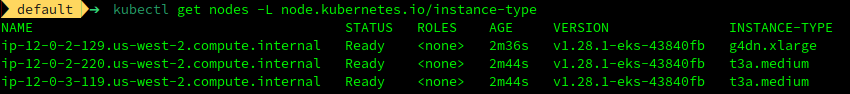
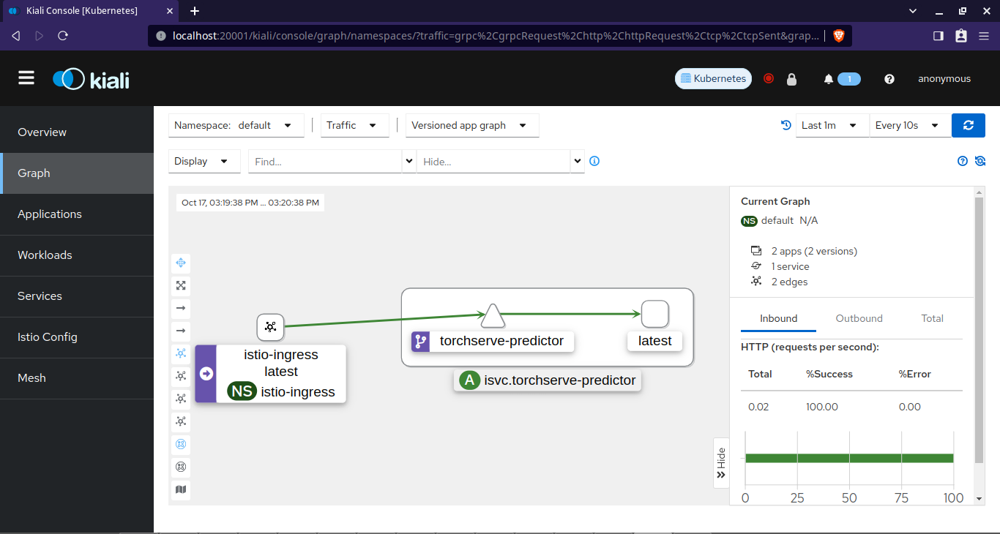
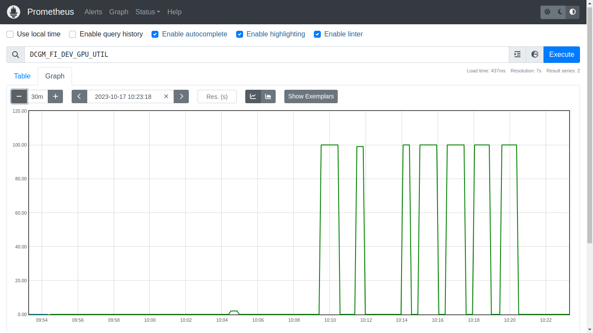

<div align="center">

# Istio and KServe

</div>

# Overview
In this repository, we deploy SDXL model on Kubernetes using KServe. The application is exposed via a Load Balancer. The resulting deployment can be monitored for various parameters and can be visualized in tools like Kiali, Prometheus, and Grafana.

# Create SDXL MAR

We create the MAR file to be used by TorchServe/KServe.


```bash
python download_model.py 
bash zip_model.sh
docker pull pytorch/torchserve:0.8.1-gpu
docker run -it --rm --shm-size=1g --ulimit memlock=-1 --ulimit stack=67108864 --gpus all -v `pwd`:/opt/src pytorch/torchserve:0.8.1-gpu bash
```

Inside the container, run the following commands

```bash
cd /opt/src
torch-model-archiver --model-name sdxl --version 1.0 --handler sdxl_handler.py --extra-files sdxl-1.0-model.zip -r requirements.txt
```

# Test locally

We will test the MAR file locally using TorchServe.


```bash
docker build -t emlo:s19 . --no-cache 
docker compose up

#separate terminal
curl http://localhost:8081/models
python test.py
```

## Upload to S3

```bash
aws s3 cp config.properties s3://emlo-s19-pt/config/
aws s3 cp sdxl.mar s3://emlo-s19-pt/model-store/
```


# Setup


```bash
export REGION=...
export ACCOUNT_ID=...
export CLUSTER_NAME=emlo-s19-cluster
```


```bash
curl -fsSL https://raw.githubusercontent.com/aws/karpenter/"${KARPENTER_VERSION}"/website/content/en/preview/getting-started/getting-started-with-karpenter/cloudformation.yaml  > $(mktemp) \
&& aws cloudformation deploy \
  --stack-name "Karpenter-${CLUSTER_NAME}" \
  --template-file "${TEMPOUT}" \
  --capabilities CAPABILITY_NAMED_IAM \
  --parameter-overrides "ClusterName=${CLUSTER_NAME}"
```

## Create Cluster
>Note: For this deployment, a VPC (with public subnets only) is created manually and then used for the cluster.

```bash
envsubst < 00_cluster.yaml | eksctl create cluster -f -
```


We can see that the desired nodes are up and running via  `kubectl get nodes -L node.kubernetes.io/instance-type`



For the remaining setup, we
- install components such as metrics-server, NVIDIA Data Center GPU Manager, Prometheus, Grafana, Kiali, etc.
- create service accounts and policies for S3 read only access
- install Istio and KServe etc.


All of these steps are mentioned in the [setup guide](./setup.md).

# Deploy SDXL


```bash
kubectl apply -f 06_sdxl.yaml
```

Make sure the pod is up and running.

```bash
kubectl get pods, isvc
kubectl logs torchserve-predictor-****
```

# Running Inference

```bash
export INGRESS_HOST=$(kubectl -n istio-ingress get service istio-ingress -o jsonpath='{.status.loadBalancer.ingress[0].hostname}')
export INGRESS_PORT=$(kubectl -n istio-ingress get service istio-ingress -o jsonpath='{.spec.ports[?(@.name=="http2")].port}')

export MODEL_NAME=sdxl
export SERVICE_HOSTNAME=$(kubectl get inferenceservice torchserve -o jsonpath='{.status.url}' | cut -d "/" -f 3)
```


```bash
python 08_test_kserve.py
```


# Generated Images

**Prompt:** a cat programming on a beach


**Prompt:** a cat playing football on a beach


**Prompt:** a cat looking at its reflection in water


**Prompt:** a cat talking on a mobile phone


**Prompt:** a cat staring at a chicken


# Kiali Graph for the Predictor




# GPU Usage

### Prometheus



### Grafana
[](https://www.youtube.com/embed/VINH4e3zUZU)


### Kiali Logs

[](https://www.youtube.com/embed/qQDsI94ylvA)


# Inference Demo

To see the logs dynamically, k9s is used.

[](https://www.youtube.com/embed/NfLpZzUyMJc)


# Logs

[kubectl get all -A  -o yaml](./logs/output.md)

[TorchServe Predictor](./logs/default-torchserve-predictor.md)
